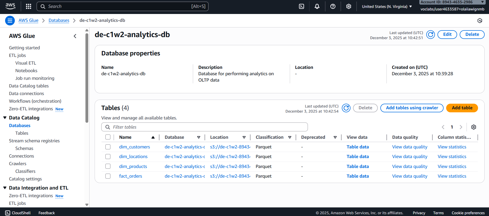
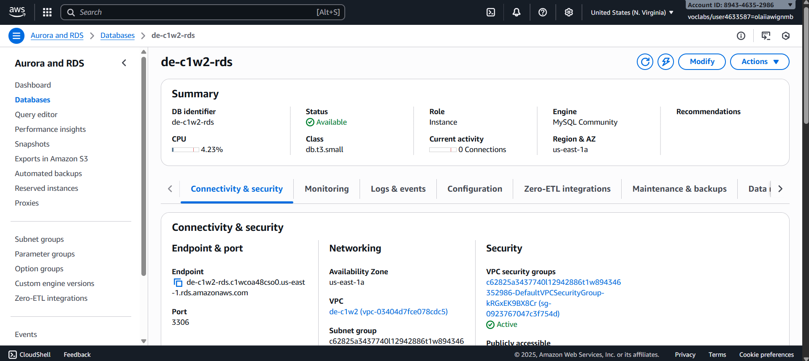
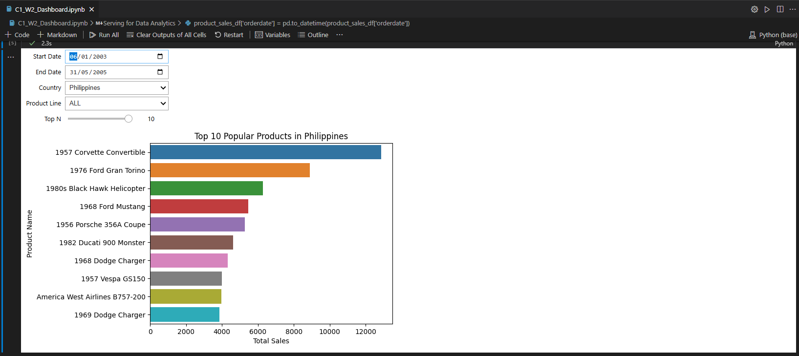

# Terraform-Powered AWS Glue ETL: Infrastructure as Code for Data Pipelines

---

## Overview

This project demonstrates a complete **Data Engineering Lifecycle** implementation using **Infrastructure as Code (IaC)** with **Terraform** and AWS cloud services. The system automates the extraction, transformation, and loading (ETL) of retail sales data from a MySQL database (Amazon RDS) to a star schema optimized for analytics, stored in **Amazon S3** and queryable via **Amazon Athena**.

The project showcases modern data engineering practices including declarative infrastructure provisioning, data modeling, and serverless analytics—all orchestrated through Terraform configurations.

---

## Project Goals

1.  **Infrastructure as Code (IaC)**
    Define and provision AWS infrastructure using **Terraform** for reproducible, version-controlled deployments.

2.  **Source System Exploration**
    Connect to and explore a relational **MySQL database** hosted on **Amazon RDS** containing retail transaction data.

3.  **ETL Orchestration**
    Implement **AWS Glue** jobs to extract data from RDS, transform it into a star schema, and load it into S3.

4.  **Data Transformation**
    Convert normalized OLTP data into a denormalized star schema with fact and dimension tables for optimized analytics.

5.  **Serverless Analytics**
    Query transformed data directly from S3 using **Amazon Athena** without managing database infrastructure.

6.  **Data Visualization**
    Build interactive dashboards in **Jupyter Notebook** to analyze sales trends by country and product line.

---

## Tech Stack

| Technology | Purpose |
| :--- | :--- |
|  | Infrastructure as Code for AWS resource provisioning. |
|  | Serverless ETL service for data extraction, transformation, and loading. |
|  | Managed MySQL database as the source system (OLTP). |
|  | Scalable object storage for transformed data (data lake). |
|  | Serverless SQL query engine for S3 data. |
|  | ETL logic in Glue jobs and data analysis in Jupyter. |
|  | Source database containing retail transaction data. |

---

## Architecture Diagram


### Architecture Components

-   **Source Database (Amazon RDS - MySQL)**: An OLTP system storing normalized retail data across 8 tables (customers, products, orders, etc.).
-   **ETL Layer (AWS Glue)**: Serverless ETL jobs that extract data from RDS, transform it into a star schema, and load it into S3 in Parquet format.
-   **Storage Layer (Amazon S3)**: Data lake storing transformed data in a columnar format optimized for analytics.
-   **Serving Layer (Amazon Athena)**: SQL query engine enabling ad-hoc analytics directly on S3 data.
-   **Analytics Layer (Jupyter Notebook)**: Interactive dashboards for data visualization and business insights.

---

## Dataset

-   **Source**: [MySQL Sample Database - Classic Models](https://www.mysqltutorial.org/mysql-sample-database.aspx)
-   **Description**: A retailer database containing historical purchases and customer information across 8 tables:
    -   `customers`, `products`, `productlines`, `orders`, `orderdetails`, `payments`, `employees`, `offices`
-   **Use Case**: Analyze sales trends, product line performance, and geographic distribution of purchases.

### Data Transformation: OLTP to Star Schema

**Before ETL (Normalized OLTP Schema):**


**After ETL (Star Schema for Analytics):**


The transformation creates:
-   **Fact Table**: `fact_orders` (measurements: quantity, price, order amount)
-   **Dimension Tables**: `dim_customers`, `dim_products`, `dim_locations` (context for analysis)

---

## Project Structure

```text
terraform_aws_glue_etl/
├── terraform/
│   ├── assets/
│   │   └── glue_job.py           # AWS Glue ETL job script (PySpark)
│   ├── backend.tf                # Terraform state configuration
│   ├── glue.tf                   # Glue database, connection, crawler, and job
│   ├── iam_roles.tf              # IAM roles for Glue
│   ├── policies.tf               # IAM policies for AWS service access
│   ├── network.tf                # VPC, subnet, and security group data sources
│   └── variables.tf              # Terraform input variables
├── scripts/
│   └── setup.sh                  # Environment setup script for Terraform variables
├── data/
│   └── mysqlsampledatabase.sql   # MySQL database population script
├── static/                       # Architecture diagrams and screenshots
├── Dashboard.ipynb               # Jupyter notebook for data visualization
└── README.md                     # Project documentation
```

---

## ETL Workflow

The AWS Glue job (`glue_job.py`) executes the following pipeline:

### 1. **Extract Data from RDS**
-   Connects to MySQL database via Glue JDBC connection
-   Extracts data from 5 source tables:
    -   `customers`, `orders`, `orderdetails`, `products`, `productlines`

### 2. **Transform Data (Star Schema Modeling)**
-   **Dimension Tables**:
    -   `dim_customers`: Customer details (name, contact, credit limit)
    -   `dim_products`: Product information with product line descriptions
    -   `dim_locations`: Geographic data (postal code, city, state, country)
-   **Fact Table**:
    -   `fact_orders`: Denormalized order data with measurements (quantity, price, order amount)
-   Uses **PySpark SQL** for transformations (joins, aggregations, denormalization)

### 3. **Load Data to S3**
-   Writes transformed tables to S3 in **Parquet format** (columnar, compressed)
-   Stores data in `s3://<bucket>/gold/` directory
-   Updates AWS Glue Data Catalog for Athena querying

### 4. **Catalog and Crawl**
-   AWS Glue Crawler scans S3 data and updates table schemas in the Glue Data Catalog
-   Makes data immediately queryable via Athena

---

## Setup & Installation

### Prerequisites
-   AWS Account with appropriate permissions
-   AWS CLI configured with credentials
-   Terraform installed (v1.0+)
-   MySQL client (for database exploration)
-   Python 3.8+ with Jupyter Notebook (for analytics)

### 1. Clone the Repository
```bash
git clone https://github.com/asadali27232/terraform_aws_glue_etl.git
cd terraform_aws_glue_etl
```

### 2. Verify RDS Database
Check that the RDS MySQL instance is running and get its endpoint:
```bash
aws rds describe-db-instances --db-instance-identifier de-c1w2-rds --output text --query "DBInstances[].Endpoint.Address"
```

### 3. Explore the Source Database (Optional)
Connect to the MySQL database to verify data:
```bash
mysql --host=<RDS-Endpoint> --user=admin --password=adminpwrd --port=3306
```

Inside MySQL:
```sql
USE classicmodels;
SHOW TABLES;
EXIT;
```

### 4. Configure Terraform Variables
Run the setup script to populate Terraform environment variables:
```bash
source scripts/setup.sh
```

This script:
-   Retrieves AWS resource IDs (VPC, subnets, security groups)
-   Sets Terraform variables (`TF_VAR_*`) in `~/.bashrc`
-   Uploads the Glue job script to S3
-   Configures the Terraform backend

### 5. Initialize Terraform
Navigate to the Terraform directory and initialize:
```bash
cd terraform
terraform init
```

### 6. Plan Infrastructure Changes
Preview the resources Terraform will create:
```bash
terraform plan
```

Expected resources:
-   AWS Glue Database
-   AWS Glue Connection (to RDS)
-   AWS Glue Crawler
-   AWS Glue ETL Job
-   IAM Roles and Policies

### 7. Deploy Infrastructure
Apply the Terraform configuration:
```bash
terraform apply
```

Type `yes` when prompted. Terraform will provision all AWS resources.

### 8. Verify Glue Job in AWS Console
-   Open the AWS Console
-   Navigate to **AWS Glue** → **ETL jobs**
-   Verify that `de-c1w2-etl-job` exists

### 9. Run the ETL Job
Start the Glue job:
```bash
aws glue start-job-run --job-name de-c1w2-etl-job | jq -r '.JobRunId'
```

### 10. Monitor Job Status
Check the job status (replace `<JobRunID>` with the output from step 9):
```bash
aws glue get-job-run --job-name de-c1w2-etl-job --run-id <JobRunID> --output text --query "JobRun.JobRunState"
```

Wait until the status is `SUCCEEDED` (takes 2-3 minutes).

### 11. Run the Glue Crawler (Optional)
After the ETL job completes, run the crawler to update the Glue Data Catalog:
```bash
aws glue start-crawler --name de-c1w2-analytics-db-crawler
```

---

## Querying Data with Amazon Athena

Once the ETL job completes, query the data using Athena:

### Example Queries

**1. View all products:**
```sql
SELECT * FROM dim_products LIMIT 10;
```

**2. Total sales by country:**
```sql
SELECT 
    dim_locations.country,
    SUM(fact_orders.orderAmount) AS total_sales
FROM fact_orders
JOIN dim_locations ON fact_orders.postalCode = dim_locations.postalCode
GROUP BY dim_locations.country
ORDER BY total_sales DESC;
```

**3. Top products by sales:**
```sql
SELECT 
    dim_products.productName,
    SUM(fact_orders.orderAmount) AS total_sales
FROM fact_orders
JOIN dim_products ON fact_orders.productCode = dim_products.productCode
GROUP BY dim_products.productName
ORDER BY total_sales DESC
LIMIT 10;
```

---

## Data Visualization Dashboard

Open the Jupyter Notebook to build interactive dashboards:

```bash
jupyter notebook Dashboard.ipynb
```

### Dashboard Features
-   **Interactive Filters**: Select country, product line, date range, and top N products
-   **SQL Queries via Athena**: Uses `awswrangler` to query S3 data
-   **Visualizations**: Bar charts showing top-selling products by region and category

### Sample Analysis
-   Total sales by country
-   Product line performance over time
-   Top N popular products in selected markets

---

## Services in Action

Below are snapshots showing the AWS services used in this project:

<table>
  <tr>
    <td></td>
    <td></td>
    <td></td>
  </tr>
</table>

---

## Let's Connect

[](https://wa.me/923074315952)
[](mailto:asadali27232@gmail.com)
[](https://www.linkedin.com/in/asadali27232/)
[](https://github.com/asadali27232)
[](https://www.facebook.com/asadalighaffar)
[](https://twitter.com/asadali27232)
[](https://asadali27232.github.io/asadali27232)

---